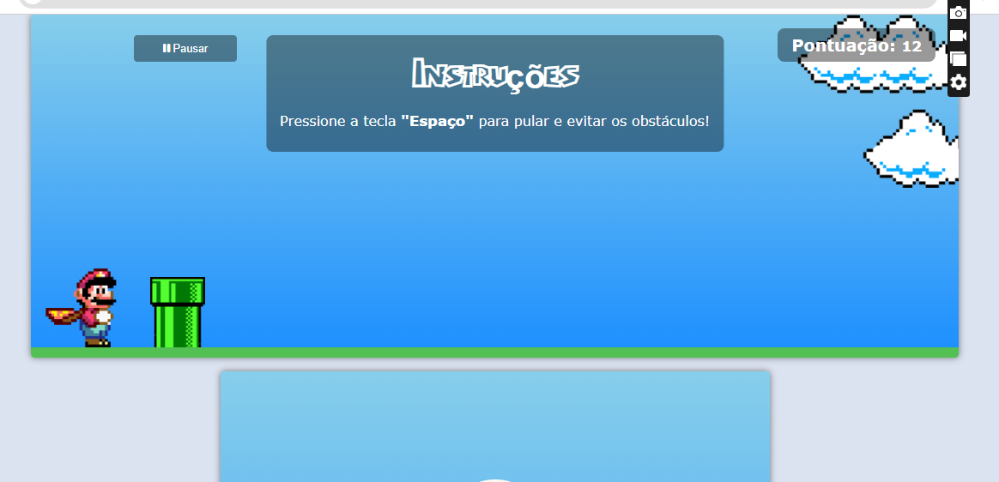

# 🎮 Mario Jump

Projeto de jogo simples inspirado no Mario, feito com **HTML**, **CSS** e **JavaScript**.  
A ideia principal é desviar dos obstáculos e somar pontos conforme o tempo passa.

## 🚀 Tecnologias utilizadas

- HTML5
- CSS3
- JavaScript puro

## ✅ Funcionalidades

- Detecção de colisão entre o Mario e os obstáculos
- Sistema de pontuação
- Troca de inimigos e cenários conforme a pontuação aumenta
- Som de pulo e de game over
- Animações com CSS e JavaScript

## 📷 Imagem do jogo



## 🔧 Como rodar o projeto

1. Clone o repositório:

```bash
git clone https://github.com/kayqueds/mario-jump.git
cd mario-jump